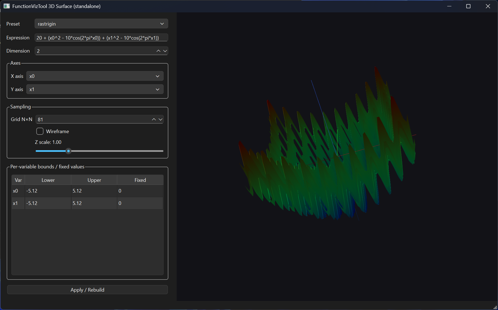

# FunctionVizTool3D

FunctionVizTool3D is a standalone C++/Qt6 desktop application that visualizes objective functions as an interactive 3D surface. You provide a mathematical expression, variable bounds, and the problem dimension. The tool samples a 2D slice (two selected variables on X/Y, all other variables fixed) and renders the resulting surface in 3D.

The long-term intent is to keep this project easy to integrate into larger optimization frameworks, but this repository is fully standalone.

## Features

- 3D surface rendering (triangulated grid) for f(x) over two selected variables.
- n-dimensional support via 2D slicing:
  - Choose X axis = xᵢ and Y axis = xⱼ
  - Hold all remaining variables at user-defined Fixed values
- Adjustable sampling density (Grid N×N).
- Wireframe mode.
- Z scale slider (compress/exaggerate height).
- Per-variable bounds and fixed values table.

## Mouse controls

- Left drag: rotate
- Right drag: pan
- Mouse wheel: zoom

## Expression format

Variables:
- x0, x1, …, x(N-1)

Constants:
- pi, e

Operators:
- +  -  *  /  ^   (power)

Functions (common):
- sin cos tan asin acos atan
- exp log log10 sqrt abs floor ceil
- min max pow

Example expressions:
- Sphere (2D): x0^2 + x1^2
- Rosenbrock (2D): (1 - x0)^2 + 100*(x1 - x0^2)^2
- Rastrigin (2D): 20 + (x0^2 - 10*cos(2*pi*x0)) + (x1^2 - 10*cos(2*pi*x1))

Note: some benchmark/engineering problems require additional data (tables/constants/shift-rotation matrices). In pure “expression mode”, only problems with a clean closed-form expression can be fully represented. A future “backend mode” can evaluate directly via an external problem library.

## Requirements

- C++17 compiler
- CMake ≥ 3.16 (newer recommended)
- Qt 6 (Widgets + OpenGL):
  - Qt6Core, Qt6Gui, Qt6Widgets
  - Qt6OpenGL, Qt6OpenGLWidgets
- OpenGL 3.3 capable driver

## Build on Linux (Ubuntu/Debian)

Install dependencies:

```bash
sudo apt update
sudo apt install -y \
  build-essential cmake ninja-build \
  qt6-base-dev qt6-tools-dev qt6-tools-dev-tools \
  libgl1-mesa-dev mesa-common-dev
```

Configure & build:

```bash
cmake -S . -B build -G Ninja -DCMAKE_BUILD_TYPE=Release
cmake --build build
```

Run:

```bash
./build/FunctionVizTool3D
```

If you are on Wayland and you hit platform plugin issues, try:

```bash
QT_QPA_PLATFORM=xcb ./build/FunctionVizTool3D
```

## Build on Linux (Fedora)

```bash
sudo dnf install -y \
  gcc-c++ cmake ninja-build \
  qt6-qtbase-devel qt6-qttools-devel \
  mesa-libGL-devel
cmake -S . -B build -G Ninja -DCMAKE_BUILD_TYPE=Release
cmake --build build
./build/FunctionVizTool3D
```

## Build on Windows (MSVC + Qt)

PowerShell example (Visual Studio 2022, Qt 6.10.1):

```powershell
cmake -S . -B build `
  -G "Visual Studio 17 2022" -A x64 `
  "-DCMAKE_PREFIX_PATH=C:\Qt\6.10.1\msvc2022_64"
cmake --build build --config Release
```

(Optional) deploy Qt DLLs next to the EXE:

```powershell
& "C:\Qt\6.10.1\msvc2022_64\bin\windeployqt.exe" `
  --no-translations --compiler-runtime `
  ".\build\Release\FunctionVizTool3D.exe"
```

## Repository layout

- README.md (this file)
- FunctionVizTool3D.png (screenshot shown at the top of the README; keep it in the repository root)
- src/ (application source)
- CMakeLists.txt

## Roadmap

- “Backend mode” to evaluate problems via an external library (e.g., direct problem->evaluate(x)) for full coverage of engineering/CEC/GKLS style problems.
- Axis labels/ticks overlay in the 3D view.
- Export current view to PNG and export sampled grid to CSV.

## License

Add your preferred license (MIT/BSD/GPL/etc.). If you don’t know yet, set this to TBD.

---

# FunctionVizTool3D (Ελληνικά)

Το FunctionVizTool3D είναι ένα αυτόνομο GUI εργαλείο σε C++/Qt6 που οπτικοποιεί αντικειμενικές συναρτήσεις ως 3D επιφάνεια. Δίνεις έκφραση (string), όρια (bounds) και διάσταση. Η οπτικοποίηση γίνεται πάνω σε 2 μεταβλητές (X/Y), ενώ οι υπόλοιπες μεταβλητές “παγώνουν” σε Fixed τιμές.

Γρήγορα βήματα (Linux):

```bash
cmake -S . -B build -G Ninja -DCMAKE_BUILD_TYPE=Release
cmake --build build
./build/FunctionVizTool3D
```
